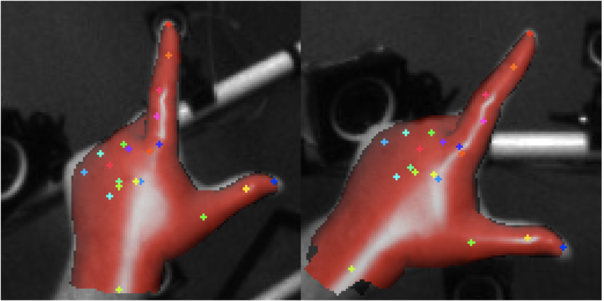

# A toolkit for egocentric hand tracking research

### Check out the [Multiview Egocentric Hand Tracking Challenge](https://eval.ai/web/challenges/challenge-page/2333/overview)!!

This repository contains the following tools for hand tracking research:

- APIs for loading data from the UmeTrack and HOT3D datasets
- Computation of metrics used in the Hand Tracking Challenge
- Data visualization helpers

## Datasets

The datasets are provided using the
[WebDataset](https://huggingface.co/docs/hub/en/datasets-webdataset) format. The
file structure of each sequence is as follows:

```
├─ train
│  ├─ subject_000_separate_hand_000000.tar
│  ├─ subject_000_hand_hand_000001.tar
│  ├─ ...
│  ├─ subject_049_hand_hand_000099.tar
├─ pose_test
│  ├─ subject_050_separate_hand_000100.tar
│  ├─ subject_050_hand_hand_000101.tar
│  ├─ ...
│  ├─ subject_079_hand_hand_000199.tar
├─ shape_test
│  ├─ subject_080_separate_hand_000300.tar
│  ├─ subject_080_hand_hand_000301.tar
│  ├─ ...
│  ├─ subject_099_hand_hand_000399.tar
```

Each tar file is assumed to contain 2~4 synchronized monochrome streams plus an
optional RGB stream. The image files are suffixed with the image stream ID which
can be used to look up the camera parameters from `*.cameras.json`. For example,
the file could have the following structure:

```
├─ subject_000_separate_hand_000000.tar
│  ├─ 000000.image_1201-1.jpg
│  ├─ 000000.image_1201-2.jpg
│  ├─ 000000.cameras.json
│  ├─ 000000.hands.json
│  ├─ 000000.hand_crops.json
│  ├─ ...
│  ├─ __hand_shapes.json__
```

Each sequence contains only one subject thus the hand shape parameters are
shared by all frames in the same sequence and are saved in
`__hand_shapes.json__`. Per-frame hand pose annotations are provided in
`*.hands.json`.


Following the
[UmeTrack](https://research.facebook.com/publications/umetrack-unified-multi-view-end-to-end-hand-tracking-for-vr/)
paper, we also provide the perspective crop camera parameters which can be used
to produce hand crop images.The figure above illustrates the usage. The
perspective crop camera parameters can be found in `*.hand_crops.json`,

### Important Notes

We provide hand shape/pose annotations for two types of hand models 1)
[UmeTrack hand model](<(https://research.facebook.com/publications/umetrack-unified-multi-view-end-to-end-hand-tracking-for-vr/)>)
and 2) [MANO hand model](https://github.com/vchoutas/smplx/). Note that the MANO
annotations are solved from the UmeTrack annotations and its overall accuracy is
therefore **slightly worse**. For training better models, we recommend using the
UmeTrack annotations to get hand keypoints for supervision.

### Data splits

Each dataset has three splits:

1. Training: all annotations are available
2. Pose estimation test: `*.hands.json` files are removed
3. Shape estimation test: `*.hands.json` files and `__hand_shapes.json__` are
   removed.

## Getting Started

### Downloading the datasets

1. [UmeTrack download link](https://huggingface.co/datasets/facebook/hand_tracking_challenge_umetrack/tree/main)
2. [HOT3D download link](https://huggingface.co/datasets/bop-benchmark/hot3d)

### Installing the toolkit

Run the following command to install the toolkit:

```
pip install git+https://github.com/facebookresearch/hand_tracking_toolkit

# (Optional) Install the third-party dependencies required for hands by reviewing and accepting the licenses provided on the corresponding third-party repositories
pip install git+https://github.com/vchoutas/smplx.git
pip install git+https://github.com/mattloper/chumpy
```

### Downloading MANO assets

Go to [https://smpl-x.is.tue.mpg.de/](https://smpl-x.is.tue.mpg.de/) to download
the MANO pickle files (`MANO_LEFT.pkl` and `MANO_RIGHT.pkl`).

### Building a simple hand crop dataset and visualizing the sample

You can build a hand crop image dataset using the following code snippet:

```python
from hand_tracking_toolkit.dataset import build_hand_dataset
from hand_tracking_toolkit.visualization import visualize_hand_crop_data
from hand_tracking_tooklit.hand_models.mano_hand_model import MANOHandModel

mano_layer = MANOHandModel("/path/to/mano/pkl/files")

root = (
    "/path/to/dataset/root"
)
sequence_names = [
    "sequence0000",
    "sequence0001"
]
dataset = build_hand_dataset(
    root,
    sequence_names,
    load_monochrome=True,
    load_rgb=True,
    output_crops=True,
    crop_size=128,
)

for i, sample in enumerate(dataset):
    img = visualize_hand_crop_data(
        sample,
        mano_layer,
        visualize_mesh=True,
        visualize_keypoints=True,
        pose_type="umetrack"
    )
    # use your favorite library to visualize the image
```

The visualization of hand crops should look like this:



## Evaluation

Evaluation is performed using the
[Multiview Egocentric Hand Tracking Challenge](https://eval.ai/web/challenges/challenge-page/2333/overview)
website. Following the data splits, the challenge has two tracks: 1) pose
estimation track and 2) shape estimation track. For each track, a submission tar
file is expected. `submissions.py` provides utility functions to generate the
submission files. The evaluation server stores the test annotation files which
are compared with the submission files to calculate the metrics.

### Submission formats

The submission file for the **pose estimation track** looks like this:

```
[
    {
        "sequence_name": "sequence0000",
        "frame_id": 0,
        "pose": [...], // mano pose parameters
        "wrist_xform": [...], // global wrist transformation
        "hand_side": 0 // left
    },
    {
        "sequence_name": "sequence0000",
        "frame_id": 1,
        "pose": [...],
        "wrist_xform": [...],
        "hand_side": 1
    },
    ...
]
```

**IMPORTANT NOTES**

- For UmeTrack, the evaluation is done for every frame, i.e. frame_id=0,1,2,3...
- For HOT3D, since the dataset is larger, the evaluation is done for every 10th
  frame, i.e. frame_id=0, 10, 20, 30...

**Please only include the frames to be evaluated in the submission files**.

The submission file for the **shape estimation track** looks like this:

```
[
    {
        "sequence_name": "sequence0000",
        "mano_beta": [...], // mano shape parameters
        "hand_side": 0 // left
    },
    ...
]
```

### How to submit

The evaluation server expects a single submission tar file for each track. The
submission tar file should contain the results of all datasets you want to
evaluate on.

Example for the pose estimation track:

```
├─ pose_submission.tar.gz
│  ├─ result_pose_umetrack.json
│  ├─ result_pose_hot3d.json
```

Example for the shape estimation track:

```
├─ shape_submission.tar.gz
│  ├─ result_shape_umetrack.json
│  ├─ result_shape_hot3d.json
```

**NOTE**: It's okay to only include the result for UmeTrack or HOT3D. The
evaluation server will automatically skip the missing files.

### Local validation

We do not provide a validation set. You can create a validation set by selecting
a subset from the training set. To prepare the annotation files (same format as
the submission files):

```sh
$OUTPUT_DIR = /path/to/output/dir
python3 scripts/write_annotations_files.py --input-dir /path/to/your/umetrack/subset --output-dir $OUTPUT_DIR

# Rename the files by adding the dataset name as the suffix
cd $OUTPUT_DIR
for i in *.json; do mv "$i" "${i%.*}_umetrack.json"; done

# Pack everything into a tar file (optional: compress with gzip)
tar -czf gt.tar.gz gt*.json /path/to/mano/dir
```

After obtaining the submission files, pack the files similarly:

```sh
tar -czf pose_submission.tar.gz result_pose_umetrack.json
tar -czf shape_submission.tar.gz result_shape_umetrack.json
```

the metrics can be obtained by running the evaluation script (the same script
that runs on the challenge server):

```sh
# pose estimation evaluation
python3 scripts/run_evaluation.par --test-annotation-file ~/eval_files/gt.tar.gz --user-submission-file pose_submission.tar.gz --phase-codename pose_estimation
# shape estimation evaluation
python3 scripts/run_evaluation.par --test-annotation-file ~/eval_files/gt.tar.gz --user-submission-file shape_submission.tar.gz --phase-codename shape_estimation
```

## Citation

If you use this toolkit for publications, please cite this work:

```
@inproceedings{han2022umetrack,
  title={UmeTrack: Unified multi-view end-to-end hand tracking for VR},
  author={Han, Shangchen and Wu, Po-chen and Zhang, Yubo and Liu, Beibei and Zhang, Linguang and Wang, Zheng and Si, Weiguang and Zhang, Peizhao and Cai, Yujun and Hodan, Tomas and others},
  booktitle={SIGGRAPH Asia 2022 Conference Papers},
  pages={1--9},
  year={2022}
}
```

## License

- This research toolkit is released under the Apache 2.0 license, as found in
  the [LICENSE](LICENSE.md) file.
- Using hands annotation requires installation of
  [SMPLX/MANO](https://github.com/vchoutas/smplx) third-party dependencies,
  please review and agree to their license listed on their website.
- Before using the UmeTrack dataset, please review and agree the
  [license](https://github.com/facebookresearch/UmeTrack_data?tab=License-1-ov-file#readme).
- Before using the HOT3D dataset, please review and agree the
  [license](https://www.projectaria.com/datasets/hot3d/license/).

## How to contribute

We welcome contributions! Go to [CONTRIBUTING](CONTRIBUTING.md) and our
[CODE OF CONDUCT](CODE_OF_CONDUCT.md) for how to get started.
